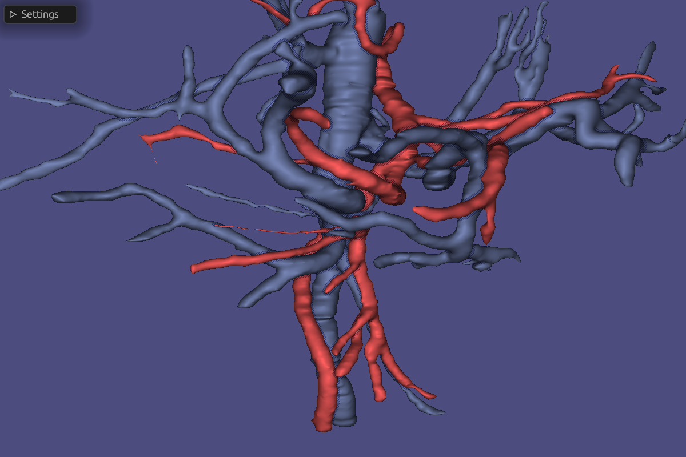

# RMedVis

<a href="https://github.com/stisol/rmedvis/actions/workflows/main.yml">
  
</a>

RMedVis is a medical visualization tool for rendering blood vessel meshes for research purposes, written in Rust and licensed under the Mozilla Public License.



## Running the application

Place any models you wish to visualize in the `assets` directory in the standard `obj` format. Vertex colors are supported, but textures are not. When ready, start the application with:

Shader files in the `shaders` directory are hot-reloaded and can be edited freely while the application is running.

```sh
cargo run --release
```

Documentation for the application can be compiled using:

```sh
cargo doc --open --document-private-items
```
